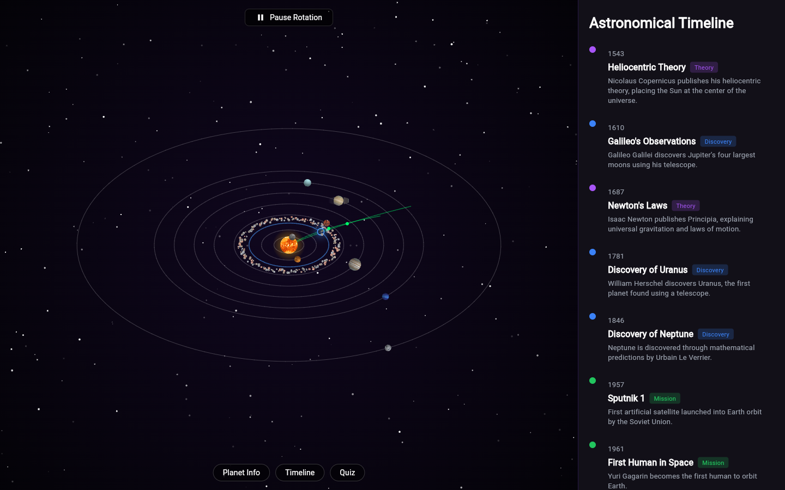
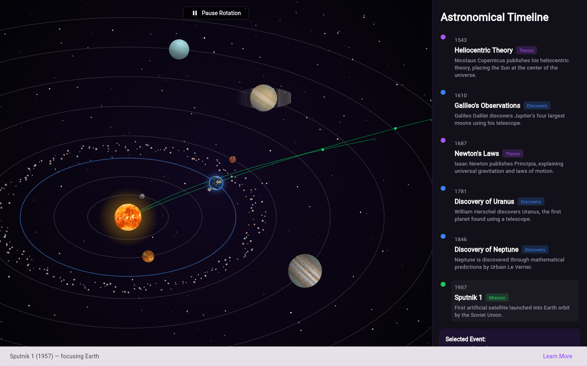
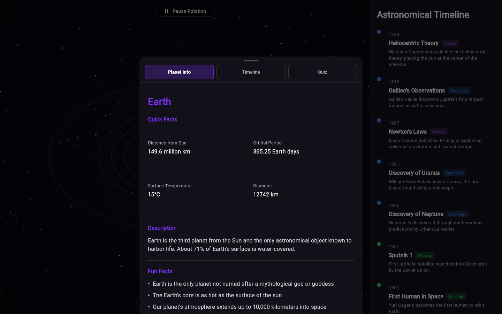
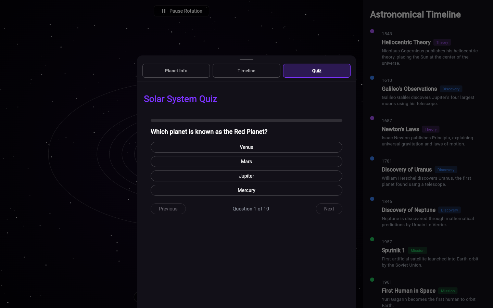
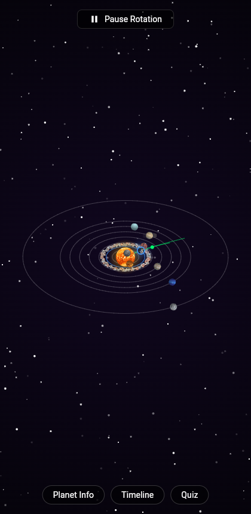

# Solar System Visualization

An interactive solar system built in Flutter — drag to rotate and tilt the camera, pinch or scroll to zoom, tap any planet to inspect it, browse a historical astronomy timeline that flies the camera to the relevant planet, and take a 10-question quiz. Runs from a single codebase on **Android, iOS, Windows, macOS, Linux, and the Web.**

🔗 **Live demo:** https://solar-system-3d-viz.web.app

## Screenshots

| Overview | Timeline → camera focus |
|---|---|
|  |  |

| Planet Info | Quiz | Mobile |
|---|---|---|
|  |  |  |

## Features

- **2D pseudo-3D solar system** — the Sun, all 9 planets plus Pluto, Earth's Moon, Saturn's rings, a 240-body asteroid belt, and two animated space-mission trajectories, all with real texture maps and sun-relative shading.
- **Camera controls** — drag to rotate/tilt, pinch or scroll to zoom, tap a planet to select it.
- **Astronomical Timeline** — 13 historical events (Copernicus to the first black-hole image); selecting one smoothly pans and zooms the camera to the planet it's about, or eases back to the full-system view for general events.
- **Planet Info panel** — quick facts, description, fun facts, and a "Learn More on Wikipedia" link.
- **Solar System Quiz** — 10 questions with live scoring and an answer review screen.
- **Responsive layout** — a persistent timeline sidebar on wide screens, a draggable bottom sheet on mobile.

## Tech stack

- **Flutter / Dart** — single codebase across mobile, desktop, and web.
- **A hand-rolled `CustomPainter` renderer** — the solar system is drawn on a `Canvas` with a tilted-ellipse projection (no external 3D/game engine), including per-frame camera easing for the timeline's "fly to planet" effect.
- **`url_launcher`** for outbound Wikipedia links.
- **Firebase Hosting** for the web deployment.

## Project structure

```
lib/
  models/     data classes (Planet, HistoricalEvent, QuizQuestion, ...)
  data/       static content (planet stats, timeline events, quiz bank)
  widgets/    SolarSystemView (the renderer), PlanetInfoPanel, TimelinePanel, QuizPanel, ControlsBar
  screens/    HomeScreen — layout, navigation, and state orchestration
  theme/      app-wide colors and Material theme
  utils/      small helpers (external link launching)
assets/textures/   equirectangular planet/sun/asteroid textures
```

## Getting started

```bash
flutter pub get
flutter run -d chrome      # or -d windows / an attached device
```

Build a release web bundle:

```bash
flutter build web --release
```

## Origin

This project began as a React Three Fiber (WebGL) web app and was rebuilt from scratch in Flutter. Rather than porting the WebGL scene 1:1, it trades a free-roaming 3D camera for a `CustomPainter`-based pseudo-3D renderer — a deliberate tradeoff for reliability and consistent behavior across every platform Flutter targets, instead of depending on a WebGL bridge.

## Credits

Planet, Sun, and asteroid textures are sourced from the original project's asset set.
