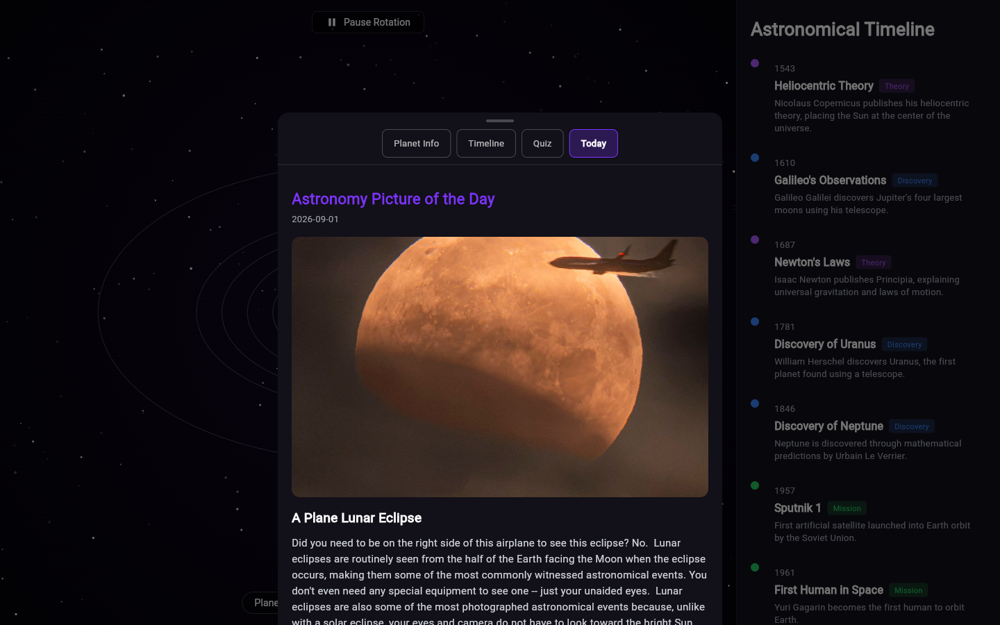
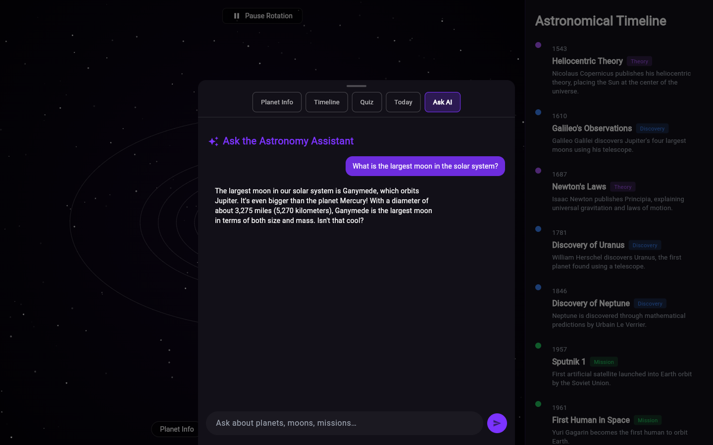

# Solar System Visualization

An interactive solar system built in Flutter — drag to rotate and tilt the camera (with momentum), pinch or scroll to zoom, tap any planet to fly the camera to it, browse a historical astronomy timeline that does the same, take a 10-question quiz, check today's NASA Astronomy Picture of the Day, and ask an AI assistant about anything you see. Runs from a single codebase on **Android, iOS, Windows, macOS, Linux, and the Web.**

🔗 **Live demo:** https://solar-system-3d-viz.web.app

## Screenshots

| Overview | Timeline → camera focus |
|---|---|
|  |  |

| Planet Info | Quiz | Astronomy Picture of the Day | Ask AI | Mobile |
|---|---|---|---|---|
|  |  |  |  |  |

## Features

- **2D pseudo-3D solar system** — the Sun, all 9 planets plus Pluto, Earth's Moon, Saturn's rings, a 240-body asteroid belt, and two animated space-mission trajectories, all with real texture maps and sun-relative shading.
- **Camera controls** — drag to rotate/tilt (with inertia after release), pinch or scroll to zoom, tap a planet to fly the camera to it.
- **Astronomical Timeline** — 13 historical events (Copernicus to the first black-hole image); selecting one smoothly pans and zooms the camera to the planet it's about, or eases back to the full-system view for general events.
- **Planet Info panel** — quick facts, description, fun facts, and a "Learn More on Wikipedia" link.
- **Solar System Quiz** — 10 questions with live scoring, an answer review screen, and a persisted best score.
- **NASA Astronomy Picture of the Day** — today's APOD with its full write-up, fetched live from NASA's public API.
- **AI astronomy chat** — ask an assistant about planets, moons, missions, or space in general; it's aware of whichever planet you currently have selected.
- **Persistence** — your last-viewed planet and best quiz score are remembered between sessions.
- **Responsive layout** — a persistent timeline sidebar on wide screens, a draggable bottom sheet on mobile.

## Tech stack

- **Flutter / Dart** — single codebase across mobile, desktop, and web.
- **A hand-rolled `CustomPainter` renderer** — the solar system is drawn on a `Canvas` with a tilted-ellipse projection (no external 3D/game engine), including per-frame camera easing for the "fly to planet" effect and its own drag-inertia physics. The underlying orbit/camera math is pure and unit-tested independently of the widget tree.
- **NASA's APOD API** (`http` package) for live data, with a CORS-proxy fallback for image display on web.
- **A Cloudflare Worker** (`worker/`) runs the chat model via [Workers AI](https://developers.cloudflare.com/workers-ai/) — entirely on Cloudflare's free tier, no API key, no billing anywhere. Rate-limited by IP via Workers KV so the shared free daily quota can't be exhausted by one visitor.
- **`shared_preferences`** for local persistence, **`url_launcher`** for outbound Wikipedia/NASA links.
- **Firebase Hosting** for the web deployment.

## Project structure

```
lib/
  models/     data classes (Planet, HistoricalEvent, QuizQuestion, ApodEntry, ...)
  data/       static content (planet stats, timeline events, quiz bank)
  services/   ApodService, ChatService — talk to NASA's API and the chat Worker
  widgets/    SolarSystemView (the renderer), PlanetInfoPanel, TimelinePanel, QuizPanel, ApodPanel, ChatPanel, ControlsBar
  screens/    HomeScreen — layout, navigation, and state orchestration
  theme/      app-wide colors and Material theme
  utils/      small helpers (external link launching, local persistence)
assets/textures/   equirectangular planet/sun/asteroid textures
test/         unit tests for the orbit/camera math, plus a smoke test for the home screen
worker/       Cloudflare Worker backing the AI chat (see worker/README.md)
```

## Testing

```bash
flutter analyze
flutter test
```

`test/orbit_math_test.dart` unit-tests the pure orbit-position and camera-focus math (no widget pumping needed, since it's factored out of the renderer as plain functions) — determinism, linearity over time, zoom/pan targets for known and unknown planets, and clamping.

## Getting started

```bash
flutter pub get
flutter run -d chrome      # or -d windows / an attached device
```

Build a release web bundle:

```bash
flutter build web --release
```

## Origin

This project began as a React Three Fiber (WebGL) web app and was rebuilt from scratch in Flutter. Rather than porting the WebGL scene 1:1, it trades a free-roaming 3D camera for a `CustomPainter`-based pseudo-3D renderer — a deliberate tradeoff for reliability and consistent behavior across every platform Flutter targets, instead of depending on a WebGL bridge.

## Credits

- Planet, Sun, and asteroid textures are sourced from the original project's asset set.
- Astronomy Picture of the Day content and imagery is provided by [NASA's APOD API](https://apod.nasa.gov/apod/astropix.html); image credit (where provided) is shown alongside each entry.
